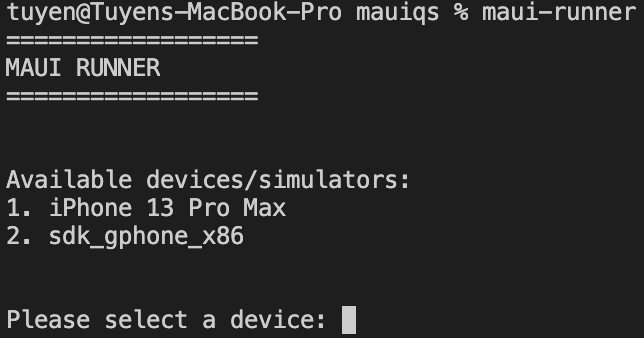

# MAUI RUNNER
A tool to run MAUI application quickly on a running iOS simulator, a running Android emulator or a connected Android device on a MacOS machine.

For more information how to setup a MacoS machine ton run MAUI application, please check out [here](https://dev.to/davidortinau/installing-net-maui-on-macos-4mmc).

# Highlights
- Able to select a running iOS simulator to run on
- Able ot select a connected Android device or a running Android emulator to run on

**NOTE**: For now, we couldn't specify which Android device/emulator to run on. Please either connect an Android device or run an Android emulator, not both.

# Installation

```
dotnet tool install MauiRunner -g \
    --version 0.0.2 \
    --add-source https://www.myget.org/F/newwavesolutions/api/v3/index.json
```

# Usage

```
1. Prepare one of the following
1.a. Open an Android emulator
1.b. Open an iOS simulator
1.c. Connect an Android device

2. Run this command

maui-runner
```

## Example Usage


